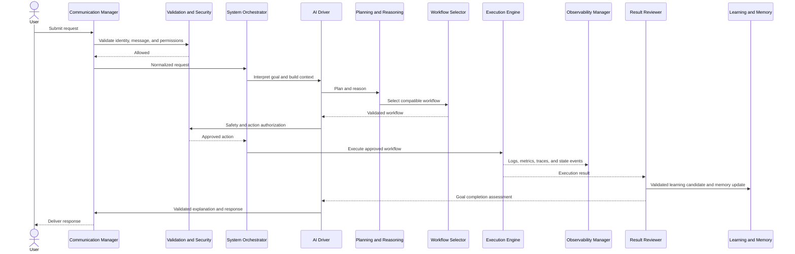
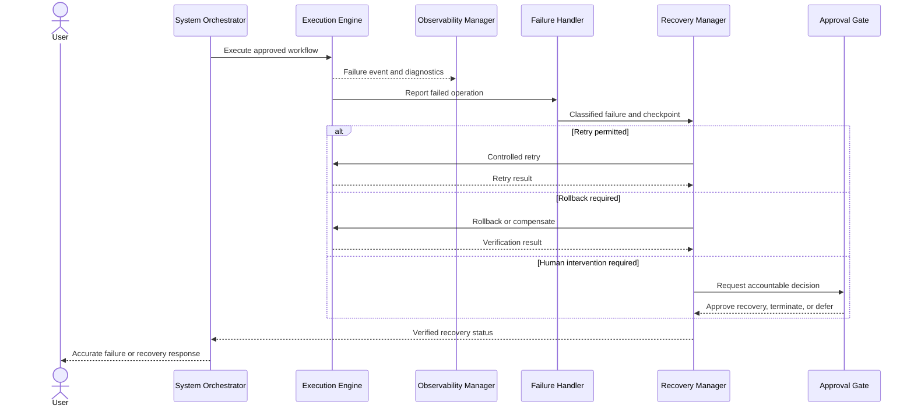
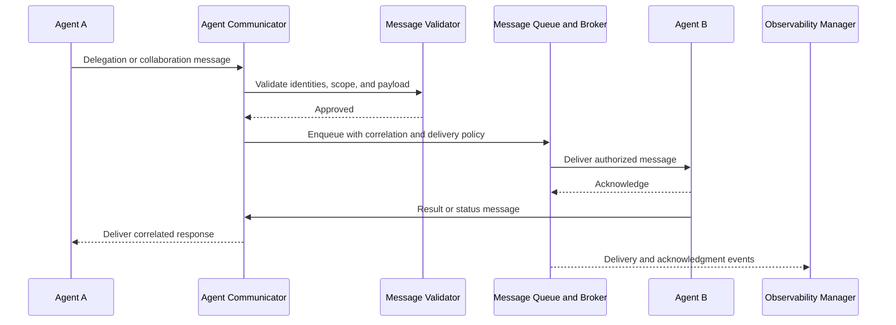
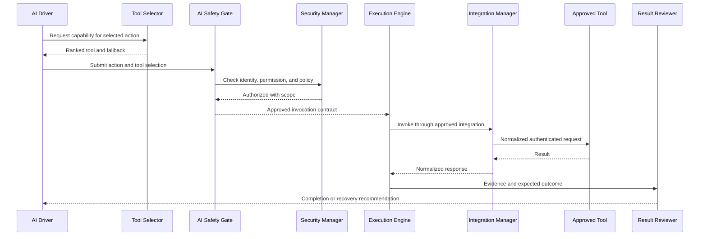

# SquirrelForge System Orchestrator

## Purpose

The System Orchestrator defines how SquirrelForge's architectural layers operate as one governed AI agent. It coordinates startup, request handling, cross-layer communication, execution, observation, learning, recovery, shutdown, and extension without absorbing the responsibilities of the components it connects.

The System Orchestrator is a control-plane specification. It establishes lifecycle order, routing boundaries, shared identifiers, readiness gates, failure propagation, and global invariants. Domain managers remain authoritative for their own state and operations.

---

## Scope and Authority

The System Orchestrator may:

- Start, stop, and health-check platform managers in dependency order.
- Create correlation, trace, request, workflow, and execution identifiers.
- Route validated requests to the responsible manager.
- Coordinate synchronous decisions and asynchronous events.
- Enforce readiness, security, validation, approval, and governance gates.
- Pause or terminate processing when a required control fails.
- Coordinate recovery without performing domain-specific recovery itself.

The System Orchestrator must not:

- Replace a domain manager as the authoritative owner of state.
- Execute tools, workflows, or storage mutations directly.
- Bypass validation, authorization, approval, or governance.
- Rewrite audit history or hide failure information.
- Treat degraded dependencies as healthy.
- Allow a response to claim success before the Result Reviewer confirms the outcome.

---

## Layer Map

| Capability | Primary Authority | Supporting Components |
|---|---|---|
| Rules and governance | `01_RULES`, layer governance components | Security, configuration, audit |
| Workflow catalog | `02_WORKFLOWS` | Workflow Selector, Automation Layer |
| Planning and state | `14_ENGINE` | Reasoning Layer, AI Driver |
| Agent execution roles | `16_AGENTS` | Agent registry and coordination services |
| Coordination | `17_COORDINATION` | Communication Layer |
| Memory | `18_MEMORY` | Storage and Knowledge Layers |
| Reasoning | `19_REASONING` | AI Driver and Knowledge Layer |
| Execution | `20_EXECUTION` | Integrations, Automation, Resilience |
| Integrations | `21_INTEGRATIONS` | Security, Configuration, Observability |
| Observability | `22_OBSERVABILITY` | Communication and Storage Layers |
| Configuration | `23_CONFIGURATION` | Secrets, environments, policy configuration |
| Security | `24_SECURITY` | Identity, authorization, encryption, compliance |
| Knowledge | `25_KNOWLEDGE` | Memory, vector storage, AI Driver |
| Optimization | `32_OPTIMIZATION` | Observability, Learning, Capacity Planning |
| Automation | `33_AUTOMATION` | Execution, Communication, Resilience |
| AI direction | `34_AI_DRIVER` | Planning, Reasoning, Models, Safety Gate |
| Resilience | `35_RESILIENCE` | Execution, Storage, Observability, Security |
| Communication | `36_COMMUNICATION` | Message Broker, Event Bus, Queue, Archiver |
| Persistence | `37_STORAGE` | Security, Resilience, Configuration |

Some capabilities are logical interfaces until a dedicated component document exists. In particular, **Input Manager** means the governed ingress function implemented through the Communication Manager, Message Validator, and channel-specific adapter. It is not permission to bypass those components.

---

## Global Identifiers

Every request carries a stable identity envelope across all layers.

| Identifier | Scope |
|---|---|
| Request ID | One external or internal request |
| Correlation ID | All operations related to the same user or system intent |
| Trace ID | End-to-end observability trace |
| Conversation ID | Conversation continuity |
| Goal ID | Structured goal produced by the Goal Interpreter |
| Workflow ID | Selected workflow definition |
| Workflow Instance ID | One execution of a workflow |
| Execution ID | One controlled execution lifecycle |
| Task ID | One task within an execution |
| Agent ID | Registered agent identity |
| Message ID | One communication envelope |
| Event ID | One immutable event occurrence |

Identifiers must be propagated, not regenerated, when control crosses a layer. A component may add a child identifier but must retain the parent correlation and trace identifiers.

---

## Startup Sequence

Startup is dependency-ordered and fail-closed. A phase may begin only when its required predecessor reports `Ready` or an explicitly permitted `Degraded` state.

### 1. Bootstrap Governance

1. Load immutable platform rules and startup policy.
2. Establish the startup audit record and root Trace ID.
3. Verify the expected platform version and environment target.
4. Refuse startup if bootstrap policy cannot be verified.

### 2. Configuration Initialization

1. Start the Configuration Manager.
2. Load the registered environment profile.
3. Resolve defaults, environment values, policy configuration, and approved overrides.
4. Initialize the Secrets Manager without exposing secret values to the orchestrator.
5. Run the Configuration Validator.
6. Freeze a versioned startup configuration snapshot.

### 3. Security Initialization

1. Start identity, authentication, authorization, encryption, and security monitoring services.
2. Load security and compliance policies.
3. Verify cryptographic key and certificate references.
4. Establish service identities for platform managers.
5. Deny all protected operations until the Security Manager reports readiness.

### 4. Storage Initialization

1. Start the Storage Manager and registered storage providers.
2. Verify document, object, vector, cache, version, backup, archive, and replication capabilities that are configured for the environment.
3. Run integrity and connectivity checks.
4. Mount no storage backend whose authorization, encryption, or health check fails.

### 5. Observability Initialization

1. Start logging, metrics, tracing, audit, telemetry, alerting, and dashboard services.
2. Verify that the startup trace and audit stream can be written.
3. Establish health-reporting intervals and alert routes.
4. Block normal operation if required audit records cannot be preserved.

### 6. Communication Initialization

1. Start the Communication Manager.
2. Initialize the Message Validator, Broker, Queue Manager, Event Bus, Archiver, and channel-specific messengers.
3. Register message schemas, topics, queues, delivery policies, and dead-letter handling.
4. Verify request-response, publish-subscribe, and acknowledgment paths.

### 7. Integration and Plugin Discovery

1. Load approved integration and plugin registries.
2. Discover installed skills, tools, connectors, APIs, model providers, and automation platforms.
3. Validate manifests, versions, capabilities, permissions, and signatures where supported.
4. Authenticate through approved managers.
5. Quarantine unregistered, incompatible, or unhealthy extensions.
6. Publish the immutable capability snapshot used for request routing.

### 8. Knowledge Initialization

1. Start the Knowledge Manager.
2. Load registered knowledge sources and indexes.
3. Verify document and vector storage connectivity.
4. Validate index versions, source provenance, citations, and access policies.
5. Mark stale or unverified collections unavailable for reasoning.

### 9. Memory Initialization

1. Start working, episodic, semantic, and project memory services.
2. Load retention and privacy policies.
3. Verify memory indexes and backing stores.
4. Restore only memory compatible with the active identity, project, environment, and configuration version.

### 10. AI Driver and Reasoning Initialization

1. Start the AI Driver, Goal Interpreter, Context Builder, Action Selector, Tool Selector, Prompt Compiler, Result Reviewer, Explanation Generator, and AI Safety Gate.
2. Discover approved model providers and models through the Integration Layer.
3. Load reasoning strategies, decision rules, risk thresholds, and model-routing policy.
4. Validate provider independence by ensuring that model-specific transformations remain behind the prompt and provider interfaces.

### 11. Workflow and Agent Registration

1. Load workflow definitions and validate their schemas, dependencies, permissions, recovery plans, and observability requirements.
2. Register agent identities, capabilities, roles, tool permissions, communication permissions, and health endpoints.
3. Reject duplicate identifiers or incompatible versions.
4. Publish workflow and agent availability events.

### 12. Execution, Automation, Optimization, and Resilience Initialization

1. Start the Execution Engine and its dispatcher, checkpoint, logging, monitoring, result, failure, rollback, and reporting services.
2. Start the Automation Manager and register approved rules, schedules, triggers, and approval gates.
3. Start optimization services in advisory mode until sufficient telemetry exists.
4. Start recovery, rollback, self-healing, redundancy, failover, disaster recovery, and business continuity services that exist in the active environment.

### 13. Readiness Gate

The platform becomes available only when:

- Configuration is valid and versioned.
- Security controls are active.
- Required storage is writable and recoverable.
- Audit, logging, metrics, and tracing are operational.
- Communication paths are verified.
- Required knowledge and memory stores are available.
- At least one approved workflow and agent are registered.
- Required execution and recovery services report readiness.
- Every critical component has emitted a health record.

Optional components may be `Degraded` only when policy defines a safe fallback. The readiness report must list all unavailable capabilities.

---

## Request Lifecycle

### Canonical Flow

```text
Input
  ↓
Input Manager
  ↓
Validation
  ↓
Planning
  ↓
Reasoning
  ↓
Workflow Selection
  ↓
Execution
  ↓
Observation
  ↓
Learning
  ↓
Memory Update
  ↓
Response
```

### Lifecycle Stages

| Stage | Authority | Required Result |
|---|---|---|
| Input | Communication Manager | Authenticated message envelope |
| Input Manager | Channel adapter, Message Validator, Conversation Manager | Normalized request with identity and correlation data |
| Validation | Security Manager and applicable validators | Explicit allow, deny, defer, or clarification decision |
| Planning | Goal Interpreter and `14_ENGINE` planners | Versioned plan with completion criteria and dependencies |
| Reasoning | `19_REASONING` and AI Driver | Explainable decision with confidence and risk assessment |
| Workflow Selection | Workflow Selector | Registered compatible workflow and fallback |
| Execution | `20_EXECUTION` | Controlled execution with checkpoints and state transitions |
| Observation | Observability Manager | Complete logs, metrics, trace spans, and audit records |
| Learning | Result Reviewer and approved learning services | Validated learning candidate, not automatic truth |
| Memory Update | Memory authority | Policy-compliant, scoped, provenance-linked update |
| Response | Explanation Generator and Communication Manager | Validated response with accurate completion status |

### Processing Rules

1. The Communication Layer receives the input and creates the message envelope.
2. Identity, authorization, message structure, content policy, and request limits are evaluated before planning.
3. The Goal Interpreter converts the request into a structured goal without inventing missing critical intent.
4. The Context Builder retrieves only authorized, relevant, current memory and knowledge.
5. Planning decomposes the goal, identifies dependencies, defines checkpoints, and declares completion criteria.
6. Reasoning evaluates strategies, risk, confidence, tradeoffs, and the need for clarification or approval.
7. The Workflow Selector chooses a registered workflow or returns `No Compatible Workflow`.
8. The Automation Validator and Approval Gate apply when the request is automated or policy requires approval.
9. The AI Safety Gate and Security Manager evaluate any proposed tool or state-changing action.
10. The Execution Engine dispatches approved tasks and preserves checkpoints.
11. Observability records every significant state transition while execution proceeds.
12. The Result Reviewer compares actual results with the goal and plan.
13. Successful and failed outcomes may produce learning candidates, but validation and governance determine whether they become durable knowledge or memory.
14. The Explanation Generator produces a user-appropriate account without exposing secrets, protected data, or confidential internal reasoning.
15. The Communication Manager delivers the response and records delivery status.

---

## Cross-Layer Communication

### Communication Modes

| Mode | Use | Examples |
|---|---|---|
| Synchronous request-response | A decision is required before work can continue | Authorization, validation, workflow selection |
| Asynchronous command | Work may be queued and acknowledged | Long-running execution, archive, backup |
| Domain event | A completed state change must be announced | Workflow completed, health degraded, memory updated |
| Telemetry stream | Operational measurements | Metrics, traces, logs |
| Human approval request | Policy requires an accountable decision | Production change, high-risk tool action |

All cross-layer messages pass through the Communication Layer unless an explicitly documented in-process interface provides the same validation, identity, correlation, observability, and audit guarantees.

### Manager Call Boundaries

| Caller | May Request | Must Not Do |
|---|---|---|
| System Orchestrator | Lifecycle, readiness, routing, health, recovery coordination | Perform domain operations directly |
| Communication Manager | Validation, routing, delivery, archival | Interpret goals or execute actions |
| Configuration Manager | Validation, secret references, configuration distribution | Expose secret values or authorize users |
| Security Manager | Identity, authorization, encryption, incident response | Execute business workflows |
| AI Driver | Context, planning, reasoning, tool selection, result review | Invoke tools or mutate protected state directly |
| Planning and Reasoning Managers | Knowledge, memory, risk, workflow catalog | Dispatch execution or approve themselves |
| Workflow Selector | Workflow registry and compatibility checks | Create unregistered workflows at runtime |
| Execution Engine | Approved tools, integrations, checkpoints, results | Alter the approved goal or bypass safety gates |
| Integration Manager | Authentication, APIs, providers, connectors | Decide business intent or persist secrets in payloads |
| Automation Manager | Rules, triggers, schedules, validation, approval | Bypass human or policy approval |
| Knowledge Manager | Registered source retrieval, validation, indexing | Treat unvalidated content as authoritative |
| Memory Manager | Scoped retrieval and governed updates | Store unrestricted conversation or secret data |
| Storage Manager | Persistence, retrieval, versions, backups, replication | Define business meaning or access policy |
| Observability Manager | Logs, metrics, traces, audits, alerts | Change operational outcomes or redact failures improperly |
| Optimization Manager | Recommendations and approved optimization proposals | Apply unvalidated production changes |
| Resilience Manager | Diagnostics, retry, recovery, rollback, failover | Retry indefinitely or weaken controls |

### Event Flow

1. The source creates an immutable event with Event ID, type, version, source, timestamp, correlation data, security classification, and payload reference.
2. The Message Validator validates schema, identity, integrity, authorization, and governance.
3. The Event Bus publishes to authorized subscribers.
4. Subscribers process idempotently and acknowledge according to delivery policy.
5. Failed delivery enters policy-controlled retry and then a dead-letter path.
6. Observability records publication, delivery, acknowledgment, retry, expiration, and dead-letter state.
7. Event consumers emit new outcome events rather than editing the original event.

### Shared State

SquirrelForge has no unrestricted global mutable state. Shared state is accessed through an authoritative manager and referenced by identifiers.

| State | Authoritative Owner |
|---|---|
| Configuration snapshot | Configuration Manager |
| Identity and access decision | Security Manager |
| Conversation state | Conversation Manager |
| Goal and decision context | AI Driver and Context Builder |
| Workflow definition | Workflow catalog and Workflow Selector |
| Workflow execution state | State Manager and Execution Engine |
| Task state | Task Orchestrator |
| Knowledge asset | Knowledge Manager |
| Memory record | Memory Layer |
| Stored artifact | Storage Manager |
| Message and delivery state | Communication Manager and Message Queue Manager |
| Audit and trace state | Observability Manager |
| Recovery state | Recovery Manager |

Each execution uses an immutable configuration snapshot. Components may cache read-only copies but must not silently diverge from the authoritative version.

### Error Propagation

Every propagated error includes:

- Error ID
- Timestamp
- Correlation ID and Trace ID
- Request, workflow, execution, and task identifiers when applicable
- Source component and failed operation
- Error category and severity
- Retryable status
- Safe message and protected diagnostic reference
- Last known checkpoint
- Recovery policy reference
- User-impact assessment

Errors propagate to the immediate coordinator, Observability Manager, and Failure Handler. Security-relevant errors also go to the Security Manager. A child failure may not be converted to success without an explicit verified recovery result.

---

## Global Rules

1. Every significant action is logged with correlation and trace identifiers.
2. Every workflow is registered and validated before execution.
3. Every execution is observable from request receipt through final response.
4. Every failure produces diagnostics sufficient for safe investigation.
5. Every successful workflow may contribute a learning candidate; no outcome becomes durable knowledge without validation.
6. Every material decision is explainable at the appropriate disclosure level.
7. Every critical component reports health and readiness.
8. Every protected action receives an explicit authorization decision.
9. Every external call passes through an approved integration and authentication path.
10. Every state-changing operation has an idempotency strategy or a documented reason it cannot be idempotent.
11. Every recoverable execution has a checkpoint, retry, rollback, compensation, or escalation strategy.
12. Every message preserves source, destination, integrity, classification, and delivery status.
13. Every persistent record follows retention, privacy, encryption, versioning, and audit policy.
14. Every human approval records scope, approver, decision, conditions, and expiration.
15. No component may mark its own unverified output as globally successful.

---

## Recovery Flow

```text
Component Failure
      ↓
Failure Detection and Classification
      ↓
Checkpoint and State Preservation
      ↓
Retry Eligible? ── yes ──> Controlled Retry ── success ──> Verify and Resume
      │                               │
      no                              failure
      ↓                               ↓
Rollback or Compensation Available? ──> Execute and Verify
      │
      no / unsafe
      ↓
Human Intervention or Failover
      ↓
Verify Security, Integrity, and Health
      ↓
Resume, Terminate Safely, or Start Disaster Recovery
```

### Recovery Procedure

1. The Failure Handler captures evidence and classifies the failure.
2. The Execution Engine pauses affected work and prevents dependent tasks from advancing.
3. The Checkpoint Manager preserves the last known consistent state.
4. The Recovery Manager evaluates retry, restart, resume, rollback, compensation, failover, and manual intervention.
5. Retry occurs only for retryable failures, within configured limits, using idempotency protection and backoff.
6. Rollback or compensation occurs when retry is unsafe, exhausted, or unsuccessful.
7. Human intervention is requested when policy requires approval, data integrity is uncertain, security is implicated, or automated recovery is exhausted.
8. Resumption uses a new attempt identifier while retaining the original correlation, trace, workflow, and execution history.
9. The Result Reviewer and health monitors verify recovery before dependent work resumes.
10. The incident closes only after diagnostics, final state, user impact, and lessons learned are recorded.

Recovery must fail closed. A timeout, missing acknowledgment, unavailable audit service, or indeterminate authorization decision is not success.

---

## Sequence Diagrams

### Normal Request



### Failed Request



### Agent-to-Agent Request



### Tool Invocation



### Learning Feedback Loop

```mermaid
sequenceDiagram
    participant EXE as Execution Engine
    participant OBS as Observability Manager
    participant REV as Result Reviewer
    participant LEARN as Learning Services
    participant KV as Knowledge Validator
    participant KNOW as Knowledge Manager
    participant MEM as Memory Manager
    participant OPT as Optimization Services

    EXE->>OBS: Outcome and operational evidence
    OBS->>REV: Trace, metrics, logs, and feedback
    REV->>LEARN: Validated outcome candidate
    LEARN->>KV: Proposed lesson with provenance
    alt Knowledge-quality evidence
        KV-->>KNOW: Approve versioned knowledge update
    else Experience-specific evidence
        KV-->>MEM: Approve scoped memory update
    else Insufficient evidence
        KV-->>LEARN: Reject or retain for review
    end
    REV->>OPT: Performance and quality findings
    OPT-->>REV: Governed optimization proposal
```

---

## Extension Points

All extensions follow the same lifecycle: define, register, validate, secure, test, observe, govern, activate, monitor, and retire.

### Adding a New Agent

1. Define identity, owner, purpose, capabilities, limits, inputs, outputs, and supported workflows.
2. Register the agent and assign least-privilege permissions.
3. Define communication schemas, delegation boundaries, escalation paths, and health reporting.
4. Validate tool access, memory scope, knowledge access, and failure behavior.
5. Test normal, denied, degraded, and recovery paths.
6. Activate through a versioned registry update and publish an availability event.

### Adding a New Workflow

1. Define the goal, inputs, outputs, tasks, dependencies, completion criteria, and owner.
2. Declare permissions, approvals, checkpoints, timeouts, retries, rollback or compensation, and observability.
3. Register and validate the workflow against supported agents, tools, and environments.
4. Test idempotency, failure recovery, security, and audit completeness.
5. Version and activate the workflow; never overwrite an active historical version.

### Adding a New Tool

1. Register the tool's capability contract, provider, version, authentication method, cost, latency, and data classification.
2. Define input and output schemas, side effects, idempotency, limits, timeouts, retries, and fallback behavior.
3. Apply security, integration, safety, and governance review.
4. Add health checks, telemetry, audit fields, and secret references.
5. Test sandboxed invocation and failure handling before activation.

### Adding a New Reasoning Strategy

1. Define supported goal types, required context, assumptions, confidence model, risks, and explanation contract.
2. Register the strategy without coupling it to a specific model provider.
3. Validate deterministic rules separately from probabilistic model behavior.
4. Benchmark quality, cost, latency, safety, and failure modes against an approved baseline.
5. Deploy behind a feature flag with rollback and audit coverage.

### Adding a New Memory Backend

1. Implement the memory storage and retrieval contract.
2. Define supported scopes, consistency model, indexing, retention, deletion, encryption, backup, and migration.
3. Map identity and authorization rules to every operation.
4. Validate data portability, provenance, conflict handling, and recovery.
5. Run compatibility and migration tests before making it authoritative.

---

## Health and Lifecycle Management

Every critical component reports one of these states:

| State | Meaning |
|---|---|
| Starting | Initialization is in progress |
| Ready | Required capabilities are operational |
| Degraded | Limited operation is available through an approved fallback |
| Unavailable | Required operations cannot be performed |
| Recovering | Approved recovery is in progress |
| Stopping | New work is rejected while active work drains |
| Stopped | Component is inactive |

Health reports include component identity, version, configuration version, dependency status, last successful operation, active incidents, and timestamp. Health status must reflect real dependency health rather than process availability alone.

### Controlled Shutdown

1. Stop accepting new external requests.
2. Drain or safely pause active workflows.
3. Persist checkpoints and queued messages.
4. Flush required logs, traces, metrics, and audit records.
5. Close integration and storage sessions safely.
6. Stop agents and managers in reverse dependency order.
7. Publish and retain the final shutdown status.

---

## Architecture Principles

### Loose Coupling

Components depend on versioned contracts, messages, and registered capabilities rather than implementation details.

### Single Responsibility

Each manager owns one domain. Coordination does not transfer domain authority to the orchestrator.

### Event-Driven Communication

State changes are published as immutable events. Consumers process events idempotently and emit new outcomes.

### Auditability

Material actions, decisions, approvals, failures, recovery steps, and configuration changes produce immutable audit records.

### Explainability

Decisions preserve goals, evidence references, constraints, selected alternatives, confidence, and outcome without exposing protected reasoning or secrets.

### Security First

Identity, least privilege, deny-by-default authorization, data classification, encryption, and validation apply at every boundary.

### AI-Provider Independence

Goals, context, prompts, tool contracts, structured outputs, results, and audit records use provider-neutral schemas. Provider-specific behavior is isolated behind the Prompt Compiler, model routing interface, and AI Providers Manager.

### Fail-Safe Operation

Unknown, unavailable, expired, conflicting, or unverifiable control states block protected work until resolved.

### Versioned Evolution

Workflows, agents, tools, messages, configuration, knowledge, and policies evolve through explicit compatible versions and reversible migrations.

---

## Success Criteria

The System Orchestrator succeeds when:

- Startup is deterministic, dependency-aware, and observable.
- Requests follow one traceable lifecycle from input through response.
- Domain boundaries remain explicit and enforceable.
- Managers communicate through validated, authorized contracts.
- Shared state has a single authoritative owner.
- Errors propagate without loss of context or false success.
- Recovery preserves security, integrity, and audit continuity.
- Learning and memory updates remain validated and governed.
- Extensions can be added without coupling the platform to one agent, tool, workflow, storage backend, or AI provider.
- Every completed request has an accurate outcome, explanation, trace, and audit history.

---

## Rule

No SquirrelForge request is complete until its result has been validated, its execution and decisions are observable and auditable, required learning and memory actions have been governed, and an accurate final status has been delivered through the Communication Layer.
